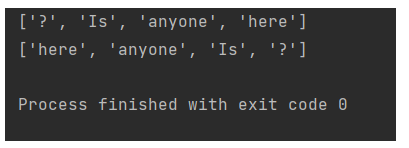
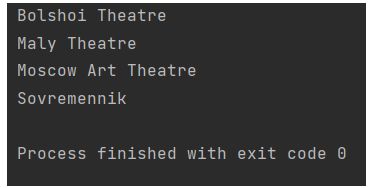

## Паттерн Итератор
``
from collections.abc import Iterator, Iterable

class IteratorTry(Iterator):
   _position: int = None
   _reverse: bool = False

   def __init__(self, collection, reverse=False):
       self._collection = sorted(collection)
       self._reverse = reverse
       self._position = -1 if reverse else 0

   def __next__(self):
       try:
           value = self._collection[self._position]
           self._position += -1 if self._reverse else 1
       except IndexError:
           raise StopIteration()
       return value

class Collection(Iterable):
   def __init__(self, collection):
       self._collection = collection

   def __iter__(self):
       return IteratorTry(self._collection)

   def reverse_it(self):
       return IteratorTry(self._collection, True)

if __name__ == "__main__":
   col = Collection(["Is", "anyone", "here", "?"])
   print(list(col))
   print(list(col.reverse_it()))
``

## Паттерн Посетитель
``
class Visitor(object):
    """Посетитель"""

    def draw(self, theatre):
        methods = {
            Bolshoi: self.draw_Bolshoi,
            Maly: self.draw_Maly,
            Art: self.draw_Art,
            Sovremennik: self.draw_Sovremennik,
        }
        draw = methods.get(type(theatre), self.draw_unknown)
        draw(theatre)

    def draw_Bolshoi(self, theatre):
        print('Bolshoi Theatre')

    def draw_Maly(self, theatre):
        print('Maly Theatre')

    def draw_Art(self, theatre):
        print('Moscow Art Theatre')

    def draw_Sovremennik(self, theatre):
        print('Sovremennik')

    def draw_unknown(self, theatre):
        print('Moscow theaters')

class Theatre(object):
    """Теарт"""

    def draw(self, visitor):
        visitor.draw(self)

class Bolshoi(Theatre):
    """Большой"""

class Maly(Theatre):
    """Малый"""

class Art(Theatre):
    """Арт"""

class Sovremennik(Theatre):
    """Современник"""

visitor = Visitor()

one = Bolshoi()
one.draw(visitor)

two = Maly()
two.draw(visitor)

three = Art()
three.draw(visitor)

four = Sovremennik()
four.draw(visitor)
``

