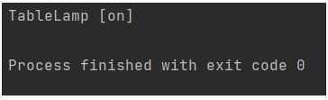
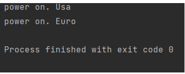
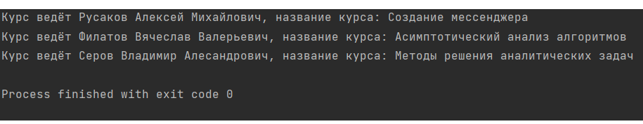

## Паттерн абстрактная фабрика
```{py}
class WindowFactory:
    @classmethod
    def create_window(cls, name):
       """Метод создания окна, возврашает класс окно"""
       return cls.Window(name)
    @classmethod
    def create_button(cls, name):
       """Метод создания кнопки, возврашает класс кнопки"""
       return cls.Button(name)

class WindowFactory:
    @classmethod
    def create_window(cls, name):
      """"Метод создания окна, возврашает класс окно"""
      return cls.Window(name)
    @classmethod
    def create_button(cls, name):
      """Метод создания кнопки, возврашает класс кнопки"""
      return cls.Button(name)

class LinuxFactory(WindowFactory):
    class Window:
        def __init__(self, name):
            self.name = name
            self.button = []
            self.style = 'Ubuntu window style'
        def add_button(self, btn):
            self.button.append(btn.name)
        def show(self):
            print( '{} - {} and {}'.format(self.name, self.style, self.button))
    class Button:
        def __init__(self, name):
            self.name = name
            self.style = 'Ubuntu button style'


def create_dialog(factory):
    wind = factory.create_window('Form1')
    button = factory.create_button('Button1')
    wind.add_button(button)
    return wind 
```
## Паттерн строитель
```{py}
class Builder(object):
    def build_base(self):
        raise NotImplementedError()

    def build_lamp(self):
        raise NotImplementedError()

    def build_battery(self):
        raise NotImplementedError()

    def create_TableLamp(self):
        raise NotImplementedError()


class TableLamp(object):
    """Настольная лампа"""

    def __init__(self, base, lamp, battery):
        self._shine = False
        self._base = base
        self._lamp = lamp
        self._battery = battery

    def on(self):
        self._shine = True

    def off(self):
        self._shine = False

    def __str__(self):
        shine = 'on' if self._shine else 'off'
        return 'TableLamp [%s]' % shine


class Lamp(object):
    """Лампочка"""


class Base(object):
    """Корпус"""


class Battery(object):
    """Батарея"""


class TableLampBuilder(Builder):
    def build_base(self):
        return Base()

    def build_battery(self):
        return Battery()

    def build_lamp(self):
        return Lamp()

    def create_TableLamp(self):
        base = self.build_base()
        lamp = self.build_lamp()
        battery = self.build_battery()
        return TableLamp(base, lamp, battery)


builder = TableLampBuilder()
tablelamp = builder.create_TableLamp()
tablelamp.on()
print(tablelamp)
```


## Паттерн адаптер
```{py}
# Американская вилка
class UsaFork:
    def power_usa(self):
        print('power on. Usa')
# Европейская вилка
class EuroFork:
    def power_euro(self):
        print('power on. Euro')
# Американская розетка
class UsaSocket:
    def __init__(self, fork):
        self.fork = fork
    def connect(self):
        self.fork.power_usa()

# Адаптер для вилки под розетку
class AdapterEuroInUsa:
    def __init__(self):
        self._euro_fork = EuroFork()
    def power_usa(self):
        self._euro_fork.power_euro()


# Вставляем американскую вилку в американскую розетку.
uf = UsaFork()
us = UsaSocket(uf)
us.connect()
# >>> power on. Usa
# Вставляем евро-адаптер в американскую розетку.
ad = AdapterEuroInUsa()
us = UsaSocket(ad)
us.connect()
# >>> power on. Euro
```



## Паттерн посредник
```{py}
class Course(object):
    """Посредник"""

    def displayCourse(self, user, course_name):
        print("Курс ведёт {}, название курса: {}".format(user, course_name))


class User(object):
    '''Класс, экземпляры которого хотят взаимодействовать друг с другом'''

    def __init__(self, name):
        self.name = name
        self.course = Course()

    def sendCourse(self, course_name):
        self.course.displayCourse(self, course_name)

    def __str__(self):
        return self.name


"""Основной метод"""

if __name__ == "__main__":
    rusakov = User('Русаков Алексей Михайлович')
    filatov = User('Филатов Вячеслав Валерьевич')
    serov = User('Серов Владимир Алесандрович')

    rusakov.sendCourse("Создание мессенджера")
    filatov.sendCourse("Асимптотический анализ алгоритмов")
    serov.sendCourse("Методы решения аналитических задач")
```


