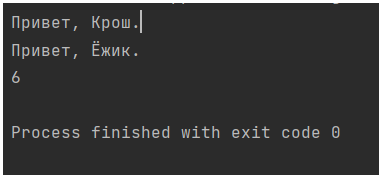
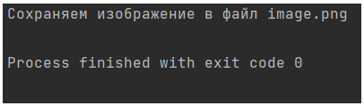
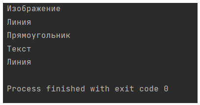

## Паттерн инверсия управления
```{py}
people = []
numbers=[]
def hello_people():
    for person in people:
        print(f"Привет, {person}.")

def calculation(sum=0):
    for num in numbers:
        sum=num+sum
    print(sum)


people.append("Крош")
people.append("Ёжик")
hello_people()

numbers.append(4)
numbers.append(2)
calculation()
```



## Паттерн заместитель
```{py}
rom functools import partial


class ImageBase(object):
    """Абстрактное изображение"""

    @classmethod
    def create(cls, width, height):
        """Создает изображение"""
        return cls(width, height)

    def draw(self, x, y, color):
        """Рисует точку заданным цветом"""
        raise NotImplementedError()

    def fill(self, color):
        """Заливка цветом"""
        raise NotImplementedError()

    def save(self, filename):
        """Сохраняет изображение в файл"""
        raise NotImplementedError()


class Image(ImageBase):
    """Изображение"""

    def __init__(self, width, height):
        self._width = int(width)
        self._height = int(height)

    def draw(self, x, y, color):
        print('Рисуем точку; координаты: (%d, %d); цвет: %s' % (x, y, color))

    def fill(self, color):
        print('Заливка цветом %s' % color)

    def save(self, filename):
        print('Сохраняем изображение в файл %s' % filename)


class ImageProxy(ImageBase):
    """
    Заместитель изображения.
    Откладывает выполнение операций над изображением до момента его сохранения.
    """

    def __init__(self, *args, **kwargs):
        self._image = Image(*args, **kwargs)
        self.operations = []

    def draw(self, *args):
        func = partial(self._image.draw, *args)
        self.operations.append(func)

    def fill(self, *args):
        func = partial(self._image.fill, *args)
        self.operations.append(func)

    def save(self, filename):
        map(lambda f: f(), self.operations)
        self._image.save(filename)


img = ImageProxy(200, 200)
img.fill('gray')
img.draw(0, 0, 'green')
img.draw(0, 1, 'green')
img.draw(1, 0, 'green')
img.draw(1, 1, 'green')
img.save('image.png')
```



## Паттерн компоновщик
```{py}
class Graphic(object):
    def draw(self):
        raise NotImplementedError()

    def add(self, obj):
        raise NotImplementedError()

    def remove(self, obj):
        raise NotImplementedError()

    def get_child(self, index):
        raise NotImplementedError()


class Line(Graphic):
    def draw(self):
        print('Линия')


class Rectangle(Graphic):
    def draw(self):
        print('Прямоугольник')


class Text(Graphic):
    def draw(self):
        print('Текст')


class Picture(Graphic):
    def __init__(self):
        self._children = []

    def draw(self):
        print('Изображение')
        for obj in self._children:
            obj.draw()

    def add(self, obj):
        if isinstance(obj, Graphic) and not obj in self._children:
            self._children.append(obj)

    def remove(self, obj):
        index = self._children.index(obj)
        del self._children[index]

    def get_child(self, index):
        return self._children[index]


pic = Picture()
pic.add(Line())
pic.add(Rectangle())
pic.add(Text())
pic.draw()

line = pic.get_child(0)
line.draw() 
```


